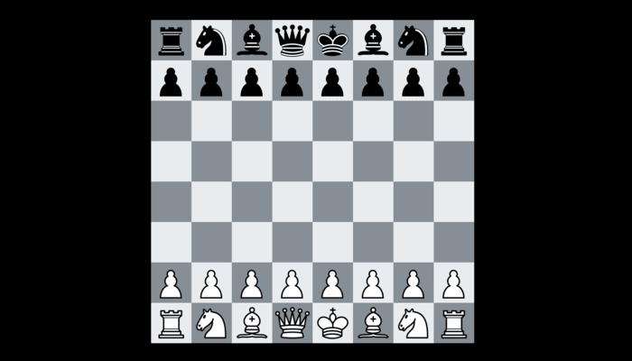

# Chess-GUI-for-UCI 


A complete SFML chess GUI for playing, running engine matches and tournaments, analysing positions, and — most importantly — **testing your own UCI chess engine** while you develop it.

License: GPL-2.0 · C++17 · SFML 2.5+ · Windows / macOS / Linux

## Features

**Play**
- Human vs human, and human vs any UCI engine (as White or Black)
- Full legal chess: castling, en passant, promotions (with picker), pins/checks
- All draw rules: stalemate, 50-move, threefold repetition, insufficient material
- Real ticking clocks with increments (1+0, 3+2, 5+0, 10+0, 15+10, 30+0), flag detection
- Drag-and-drop *and* click-click moving, legal-move dots, last-move & check highlights
- Board flip (F), coordinates, move list in SAN, keyboard navigation through the game (arrow keys)
- Takeback, resign, copy/paste FEN via clipboard, save PGN (auto-timestamped into `games/`)

**Engines**
- Load any UCI engine; engines dropped into `Resources/engines/` are auto-discovered
  (common Stockfish install paths are also detected)
- Engines run on background threads — the UI never freezes
- Engine crash / illegal move / timeout handling with forfeit results

**Engine vs Engine & Tournaments**
- Select 2 engines for a match, or 3+ for a round-robin tournament
- Configurable games per pairing (colors alternate) and time control
- Live board, live eval, standings table (+/=/- and points), and a rolling log
- Save all tournament games as a single PGN archive

**Analysis**
- Analysis board (set any FEN, move pieces for both sides)
- Toggle live engine analysis in any game: eval bar, depth, score, principal variation
- Analysis follows you as you browse back through the move list

**Engine developer tools** (Menu → Engine Testing Tools)
1. **GUI self-test** — verifies the built-in move generator against the perft suite.
2. **Move-generator test for YOUR engine** — sends `go perft <depth>` for every position in
   the suite and compares your engine's node counts against verified expected values.
   Ships with `Resources/perftsuite.epd`: **100 positions** (classic tricky positions —
   Kiwipete, en-passant pins, promotion storms — plus varied real-game middlegames),
   each with depth-1..4 node counts computed by the GUI's verified generator and
   cross-checked against Stockfish 16. Any mismatch prints the exact FEN + depth so you
   can debug with `divide`.
3. **Accuracy test** — your engine plays a set of test positions; a reference engine
   (e.g. Stockfish) evaluates its choices. Reports per-move centipawn loss, average
   centipawn loss, blunders/mistakes/inaccuracies, and a Lichess-style accuracy %.

### Requirements for the perft test
Your engine must answer `go perft N` by printing a line containing `Nodes searched: X`
(Stockfish's format). If it doesn't, the tester tells you so — it's a ~10 line feature
that is absolutely worth adding to any engine.

### perftsuite.epd format
```
<FEN> ;D1 <nodes> ;D2 <nodes> ;D3 <nodes> [;D4 <nodes>]
```
You can replace it with the classic 126-position community suite or your own file.

## Building

```
git clone https://github.com/iman-zamani/Chess-GUI-for-UCI/
cd Chess-GUI-for-UCI
cmake -B build -DCMAKE_BUILD_TYPE=Release
cmake --build build -j
./build/chess-gui
```

- **Linux:** `sudo apt install libsfml-dev cmake g++`
- **macOS:** `brew install sfml@2 cmake` (CMakeLists already points at the sfml@2 prefix)
- **Windows:** install SFML 2.6 (e.g. via vcpkg: `vcpkg install sfml`) and build with
  Visual Studio or MinGW via CMake.

Put UCI engine executables in `Resources/engines/` (e.g. download Stockfish and drop it
in) and they appear automatically in every engine-selection screen. You can also type an
absolute path in the picker.

## Resources folder
- `pieceTexture.png` — 6×2 sprite sheet of 150 px sprites (K Q B N R P; white row, black row).
  If missing, the GUI falls back to letter pieces so it still runs.
- `arial.ttf` — UI font (falls back to system fonts if absent)
- `engines/` — your UCI engines
- `perftsuite.epd` — the 100-position move-generator test suite

## Source layout
| File | Purpose |
|---|---|
| `src/chess.{hpp,cpp}` | Rules, legal move generation, FEN, SAN, PGN, perft, game state |
| `src/uci_engine.{hpp,cpp}` | Cross-platform UCI engine process wrapper (Win32 + POSIX) |
| `src/tournament.{hpp,cpp}` | Threaded match / round-robin tournament runner |
| `src/testing.{hpp,cpp}` | Perft suites, engine perft tester, accuracy tester |
| `src/gui.{hpp,cpp}` | All SFML screens, board rendering, input |
| `src/main.cpp` | Entry point |

The old `board.*` / `piece.*` files from earlier versions are superseded by this
architecture and should be removed from the build.

## Verification
- The internal generator passes the six canonical perft positions (startpos d5 = 4,865,609;
  Kiwipete d4 = 4,085,603; positions 3–6) plus en-passant-pin corner cases.
- Every entry in the shipped `perftsuite.epd` was cross-checked against Stockfish 16.
- The UCI wrapper, match runner, and accuracy tester were exercised headlessly against
  real Stockfish (full 2-game match with clocks → valid PGN output).


## License

This project is licensed under the GNU General Public License v2.0.
See [`LICENSE`](./LICENSE) for full terms.
